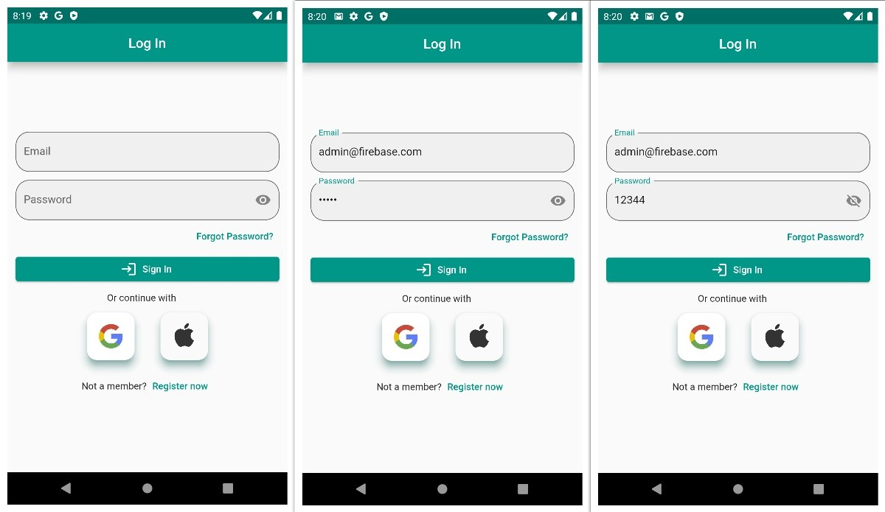

# Flutter FireBase Authentication App

## Descreption
This is a FireBase Authentication App Includes Sign In with Google , FireBase Sign In , FireBase Sign UP , Forgot Password.
You can see the all project clean code and i use bloc Pattern for auth and cubit for google auth.

## Packages
-google_sign_in: ^6.1.5
-firebase_auth: ^4.11.1
-firebase_core: ^2.19.0
-equatable: ^2.0.5
-flutter_bloc: ^8.1.3
-dartz: ^0.10.1
-fluttertoast: ^8.2.2
-internet_connection_checker: ^1.0.0+1

## App ScreenShots 
-LogIn

-SignUp

-Goggle SignIn

